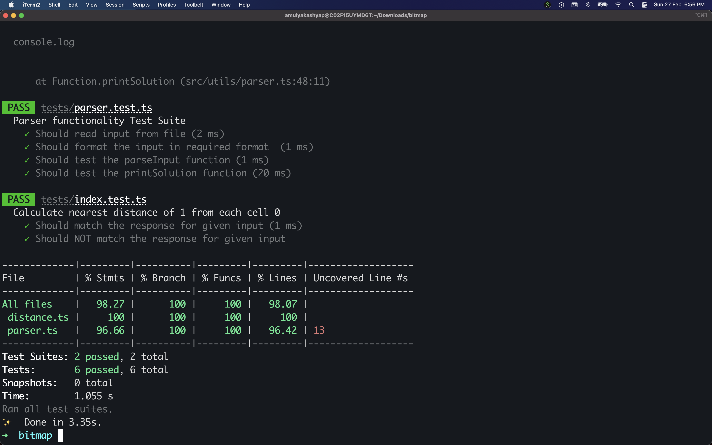

# Bitmap Challenge

## Task

There is given a rectangular bitmap of size n\*m. Each pixel of the bitmap is either white or black, but at least one is white. The pixel in i-th line and j-th column is called the pixel (i,j). The distance between two pixels p1=(i1,j1) and p2=(i2,j2) is defined as d(p1,p2)=|i1-i2|+|j1-j2|.

Write a program which:

- Reads the description of the bitmap from the standard input.
- For each pixel, computes the distance to the nearest white.
- writes the results to the standard output.

### Input

- The number of test cases t (1≤t≤1000) is in the first line of input.
- Then t test cases follow separated by an empty line.
- In the first line of each test case there is a pair of integer numbers n, m separated by a single space, 1<=n <=182, 1<=m<=182.
- In each of the following n lines of the test case exactly one zero-one word of length m, the description of one line of the bitmap, is written.
- On the j-th position in the line (i+1), 1 <= i <= n, 1 <= j <= m, is '1' if, and only if the pixel (i,j) is white.

```
1
3 4
0001
0011
0110
```

### Output

```
3210
2100
1001
```

## Usage

### APPROACH

**APPROACH** : Multi-Source Breadth First Search

**PSEUDO CODE** : 
 - Create an empty queue.
 - Traverse the whole matrix and insert the coordinates of all 1’s in the queue in the form of a pair.
 - Now do a BFS traversal of the graph using the above created queue.
 - Run a loop till the queue is not empty.
 - Extract the front node of the queue and pop it and insert all its adjacent and unmarked elements by moving one step at a time in any of the four directions.
 - Update the minimum distance as the distance of current node +1 and insert the coordinates of the next element in the queue.

**Time Complexity** 
- O(N*M), where ‘N’ is the number of rows and ‘M’ is the number of columns of the matrix.

**Space Complexity**
- O(N*M), where ‘N’ is the number of rows and ‘M’ is the number of columns of the matrix.

### Running the code

1. Install dependencies

```
yarn install
```

2. Modify [input.txt](input.txt) with desired cases or use the defaults.

3. Execute the code that'll solve the test cases and output to console.

```
yarn run start
```

### Running the test suite

```
yarn run test
```


